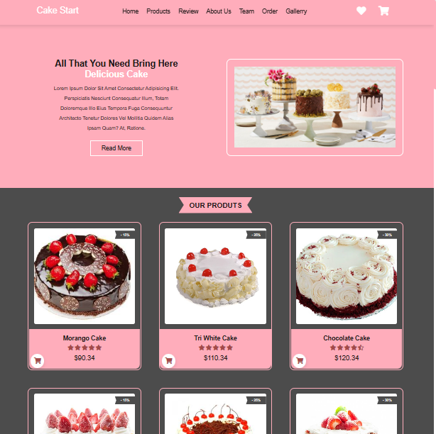
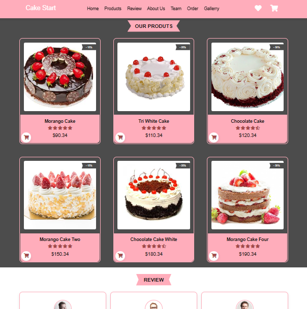
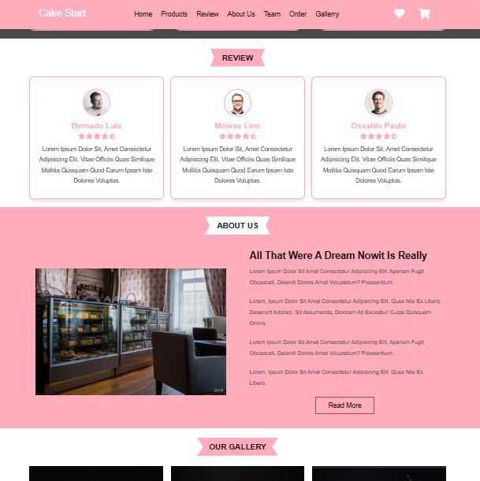
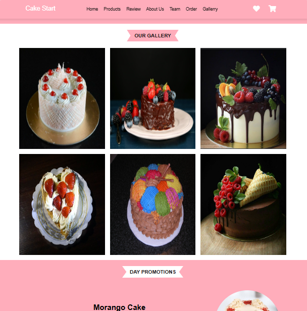
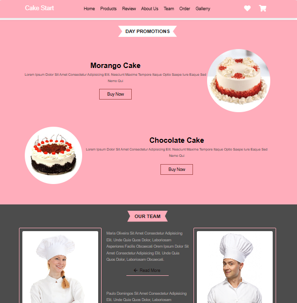
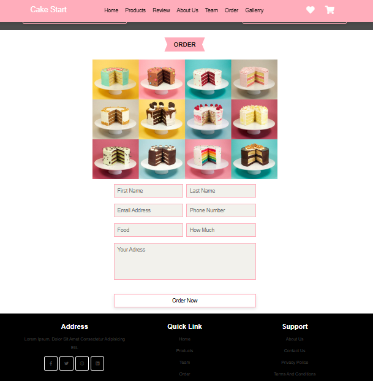

<h1 align="center" style="font-weight: bold;"> Responsive Cake Website</h1>

  
  
  

 

 <a href="#about">About</a> • 
 <a href="#started">Getting Started</a> • 

    
    
    
    
    
    

<h2 id="about">📌 About</h2>
Criou-se  design de site Responsivo de Bolo, utilizou-se HTML, CSS e JavaScript. Este Projeto contém as seguintes seções:Home, Produtos,Sobre nós, nosso time, galeria e muito mais.  

<h2 id="started">🚀 Getting started</h2>
Para executar o projeto é só baixar os arquivos e rodar o index.html

